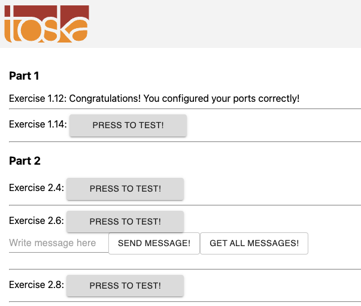

# Commands used

```bash
$ docker build . -t exer-1-12
```

```bash
$ docker run -p 5000:5000 exer-1-12
```

## result:
```
INFO: Accepting connections at http://localhost:5000
```

## result in broswer:
