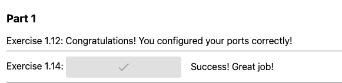

# Commands used

## Frontend
```bash
$ docker build . -t frontend
```

```bash
$ docker run -p 5000:5000 frontend
```

## Backend
```bash
$ docker build . -t backend
```

```bash
$ docker run -p 8080:8080 backend
```

## result in broswer:
