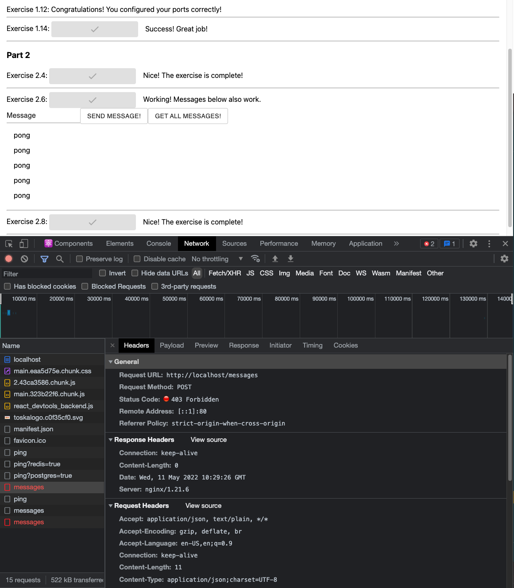

# Implementation of exercise 2.8

## Updated nginx.conf file configuration
I manage to make button "GET ALL MESSAGES!" to work but for some reason "SEND MESSAGES!" button would not work even though GET and POST it use the same URL endpoint


```nginx
events { worker_connections 1024; }

http {
  server {
    listen 80;
    
    location / {
      proxy_pass http://frontend:5000;
    }

    location /api/ {
      proxy_pass http://backend:8080/;
    }

    location /ping {
      proxy_pass http://backend:8080/ping;
    }

    location /messages {
      proxy_pass http://backend:8080/messages;
    }
  }
}
```
___
## docker-compose file configuration

```yaml
version: '3.8'

services:
  frontend:
    image: frontend
    container_name: frontend
    build:
      context: ./example-frontend
      dockerfile: Dockerfile

  backend: 
    image: backend
    container_name: backend
    build: 
      context: ./example-backend
      dockerfile: Dockerfile
    environment:
      - REDIS_HOST=redis
      - POSTGRES_HOST=postgres
      - POSTGRES_USER=postgres
      - POSTGRES_PASSWORD=postgres
      - POSTGRES_DATABASE=postgres

  redis:
    image: redis
    container_name: redis
    restart: unless-stopped
    command: redis-server
    volumes:
      - ./redis:/data

  postgres:
    image: postgres
    container_name: postgres
    restart: unless-stopped
    environment:
      - POSTGRES_HOST=postgres
      - POSTGRES_USER=postgres
      - POSTGRES_PASSWORD=postgres
      - POSTGRES_DATABASE=postgres
    volumes:
      - ./database:/var/lib/postgresql/data

  nginx:
    image: nginx
    container_name: nginx
    ports:
      - 80:80
    volumes:
      - ./nginx.conf:/etc/nginx/nginx.conf
```
___
## Change on *REACT_APP_BACKEND_URL* of __frontend__ Dockerfile
```docker
FROM node:16

WORKDIR /usr/src/app

COPY . .

ENV REACT_APP_BACKEND_URL http://localhost:80

EXPOSE 5000

RUN npm install && npm run build && npm install -g serve

CMD ["serve", "-s", "-l", "5000", "build"]
```
___
## Change on *REQUEST_ORIGIN* of __backend__ Dockerfile

```docker
FROM golang:1.16

WORKDIR /usr/src/app

EXPOSE 8080

ENV PORT 8080

ENV REQUEST_ORIGIN http://localhost:80

COPY . .

RUN go build && go test ./...

CMD ["./server"]
```
___

