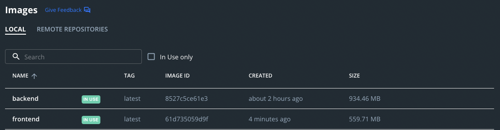
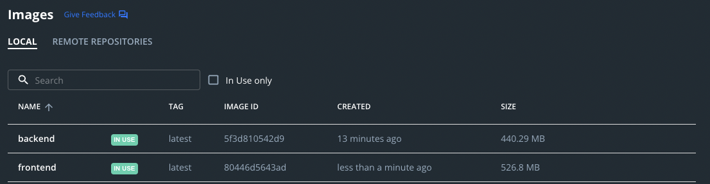

# Implementation of exercise 3.4 - Image size improvement

## Sizes have improved as we can see on the screenshots below:

## Before improvements

## After improvements

___

## Change on __frontend__ Dockerfile
```docker
FROM ubuntu:20.04 as test-stage

WORKDIR /usr/src/app

COPY . .

RUN apt-get update && apt-get install -y curl && \
  curl -sL https://deb.nodesource.com/setup_16.x | bash && apt-get install -y nodejs && \
  npm install && npm run build && npm install -g serve && \
  apt-get purge -y --auto-remove curl && \
  rm -rf /var/lib/apt/lists/* && \
  rm -rf /var/cache/apk/* && \
  useradd -m devuser && chown devuser /usr/src/app

USER devuser

CMD ["serve", "-s", "-l", "5000", "build"]
```
___
## Change on __backend__ Dockerfile

```docker
FROM golang:1.16-alpine

WORKDIR /usr/src/app

COPY . .

RUN go build && \
  adduser -D devuser && \
  chown devuser /usr/src/app

USER devuser

CMD ["./server"]
```
___
