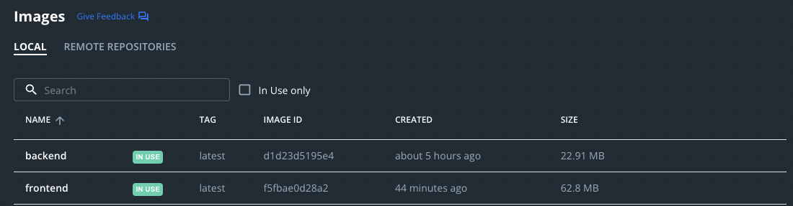

# Implementation of exercise 3.5 - Image size improvement with Alpine

## Sizes have improved as we can see on the screenshots below:

## Before improvements

## After improvements

___

## Change on __frontend__ Dockerfile
```docker
FROM node:16 as frontend-build

WORKDIR /app

COPY . .

RUN npm install && npm run build


FROM alpine

WORKDIR /root/

RUN apk update && \
  apk add nodejs npm && \
  npm install -g serve && \
  apk add ca-certificates && \
  rm -rf /var/cache/apk/* && \
  adduser -D devuser && \
  chown devuser /root/

USER devuser

COPY --from=frontend-build ./app/build ./build

CMD [ "serve", "-s", "-l", "5000", "build" ]
```
___
## Change on __backend__ Dockerfile

```docker
FROM golang:1.16-alpine AS backend-build

WORKDIR /app

COPY . /app

RUN cd /app && go build -o backend


FROM alpine

WORKDIR /app

COPY --from=backend-build /app/backend /app

RUN apk update && \
  apk add ca-certificates && \
  rm -rf /var/cache/apk/* && \
  adduser -D devuser && \
  chown devuser /app

USER devuser

ENTRYPOINT ./backend
```
___
