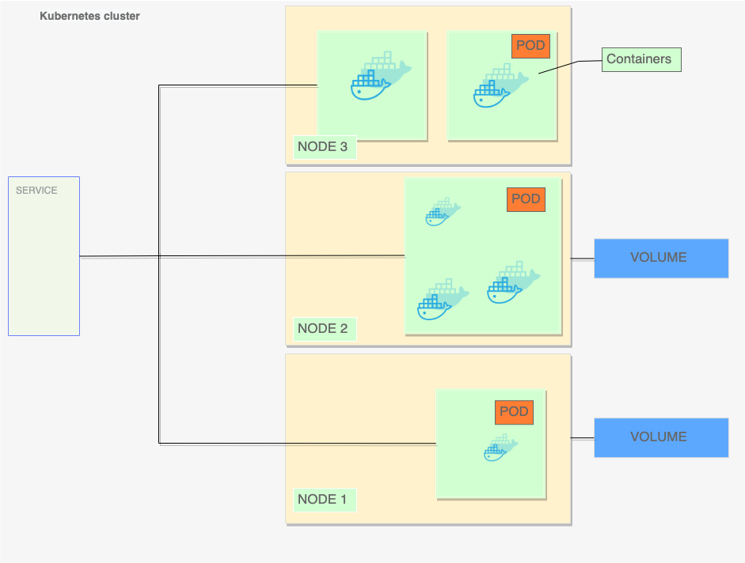

# Implementation of exercise 3.8 - Kubernetes

We have a Kubernetes cluster on which we contain a set of three nodes that run containerized applications also contained inside on a series of pods, these container with shared storage/network, and a specification for how to run the containers.

Connected we have the service which we use to expose an application running on a set of Pods as a network service.

And the volumes, a volume can be thought of as a directory which is accessible to the containers in a pod.